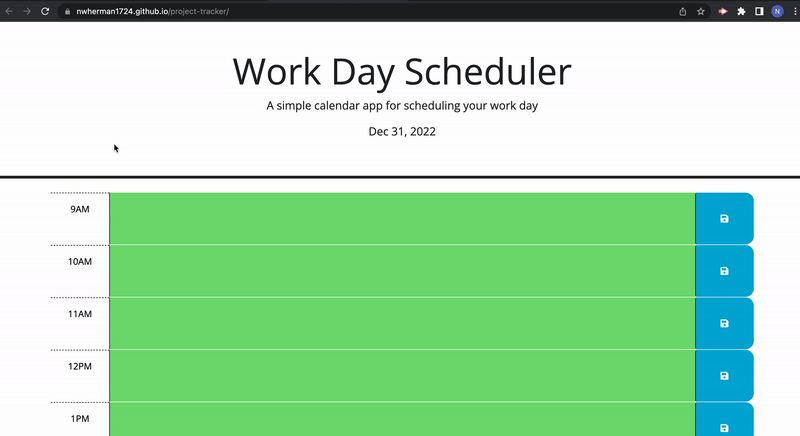

# Project-Tracker

## :bookmark_tabs: Table of Contents

- [Description](#description)
- [Usage](#usage)
- [Credits](#credits)

## :book: Description

This is the fifth Module challenge in the MSU Full-Stack coding bootcamp. It will exercise knowledge of HTML, CSS, JavaScript, and Git/Github. The objective of this project is to create a work day calendar to track activity for your workday. The user story and acceptance criteria for the project have their own sections below.

Github Pages Link: https://nwherman1724.github.io/project-tracker/

## :zap: Usage

The following animation demonstrates the application functionality:

## Credits

Project provided by MSU Full-Stack Coding Bootcamp

- - -
© 2022 edX Boot Camps LLC. Confidential and Proprietary. All Rights Reserved.
